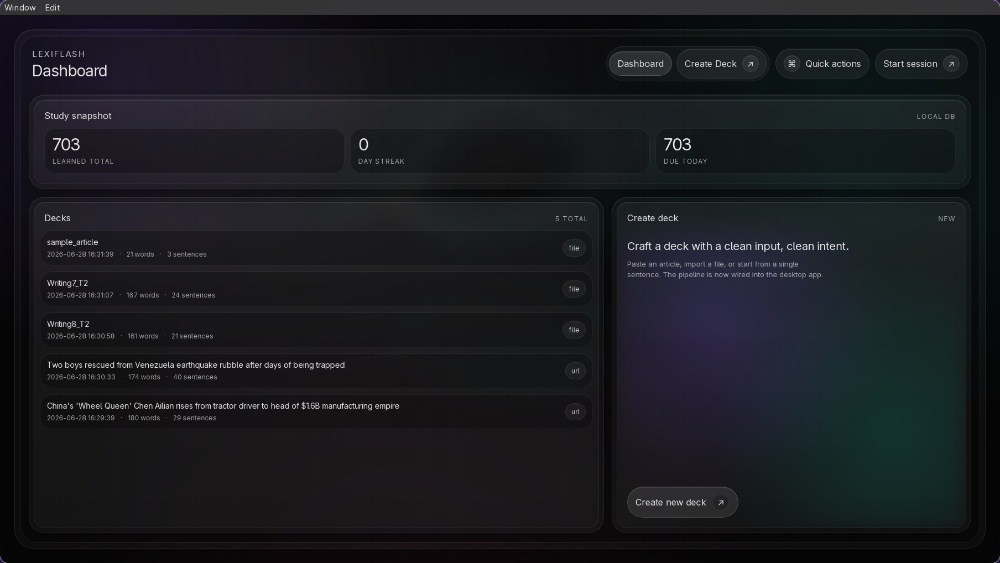

# LexiFlash

LexiFlash is a Rust-first desktop vocabulary app built with Dioxus. Active development now happens in the Rust desktop stack: `lexiflash_app/` for the application UI and persistence layer, plus `lexiflash_nlp/` for the Rust-native NLP pipeline.



## Current Focus

- Desktop UI with Dioxus in `lexiflash_app/`
- Rust-native NLP pipeline in `lexiflash_nlp/`
- URL scraping and local file parsing in the desktop app
- SQLite persistence for decks, vocabulary entries, and review state
- FSRS-backed review flow in the desktop app
- Shared `known_words.txt` input for the Rust NLP pipeline

## Legacy Note

The Python CLI branch is frozen at `v3.2.0` and is no longer developed or patched. If you need the old CLI source, check out the `v3.2.0` git tag.

## Run The Desktop App

1. Clone the repository:

   ```bash
   git clone https://github.com/QinZinn/lexiflash.git
   cd lexiflash
   ```

2. Run the desktop app:

   ```bash
   cd lexiflash_app
   cargo run --bin lexiflash_app
   ```

## Rust Checks

```bash
cd lexiflash_nlp
cargo check

cd ../lexiflash_app
cargo check
```

## Project Structure

```text
LexiFlash/
├── docs/adr/                # Architecture decisions and migration history
├── assets/                  # Documentation assets
├── known_words.txt          # Known-word source used by lexiflash_nlp
├── lexiflash_nlp/           # Rust-native NLP crate for the desktop pipeline
├── lexiflash_app/           # Dioxus desktop application
└── README.md                # Project Documentation
```

## License
MIT License. See [LICENSE](LICENSE) for details.
